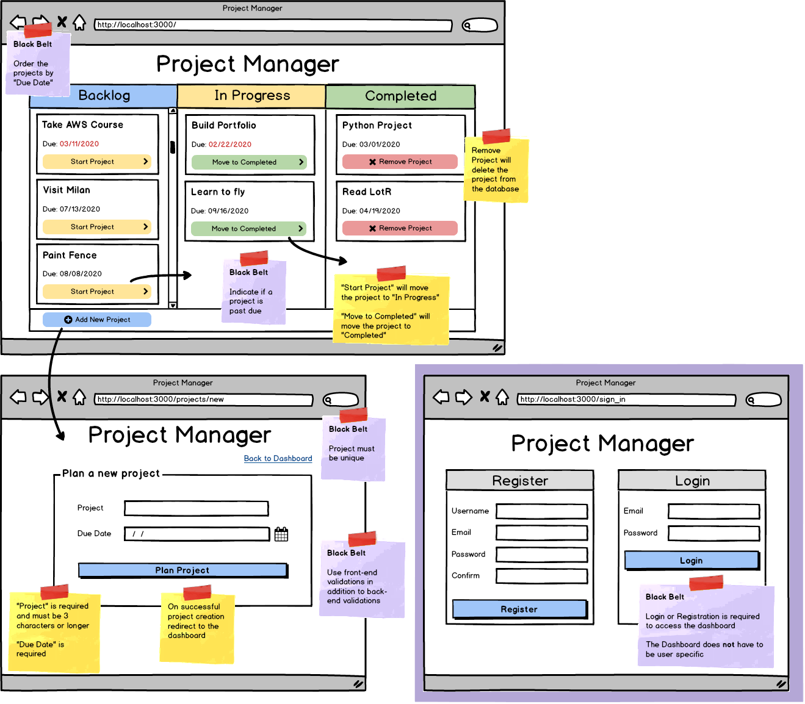

# Project Manager

Desafio: Crear un tablero kanban donde los usuarios pueden planificar y administrar proyectos.

## Cinturon Rojo

- Panel de control: muestra los proyectos en tres columnas según el estado del proyecto. [COMPLETADO]
- Panel de control: el botón "Iniciar Proyecto" ("start project") debe establecer el estado del proyecto en "En curso".[COMPLETADO]
- Panel de control: el botón "Mover a Completado" ("Move to complete") debe establecer el estado del proyecto en "Completado"[COMPLETADO]
- **Validaciones:** 
  - El proyecto es obligatorio y debe tener 3 caracteres o más.[COMPLETADO]
  - Se requiere la fecha de vencimiento.[COMPLETADO]

## Cinturon negro

- Implementado/Desplegado en Amazon EC2  

**Y 2 de las siguientes:** 
- Inicio de sesión y registro: el usuario debe iniciar sesión o registrarse para usuar el resto de la aplicación
- Ordenar los proyectos por "Fecha de vencimiento"
- Indica si el proyecto está vencido (la fecha de vencimiento es anterior a la de hoy)
- Asegurarse que el proyecto sea único al agregarlo a la base de datos
- Utilice validaciones de front-end además de validaciones de back-end

**Pistas/Recomendaciones para el Cinturón Negro:**
- Tiempo relativo: [momentjs](https://momentjs.com/)
- Unicidad:[mongoose unique validator](https://www.npmjs.com/package/mongoose-unique-validator) 